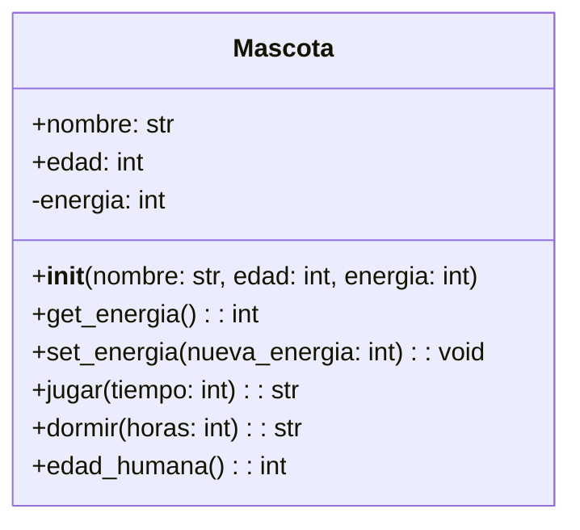

```mermaid
classDiagram

class Mascota {
    +nombre: str
    +edad: int
    -energia: int

    +__init__(nombre: str, edad: int, energia: int)
    +get_energia(): int
    +set_energia(nueva_energia: int): void
    +jugar(tiempo: int): str
    +dormir(horas: int): str
    +edad_humana(): int
}
```
