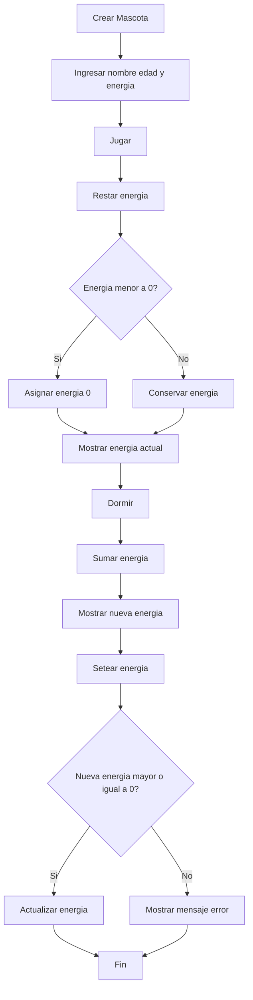

## Diagrama de flujo de la clase Mascota

```mermaid
flowchart TD

A[Crear Mascota] --> B[Ingresar nombre edad y energia]

B --> C[Jugar]
C --> D[Restar energia]

D --> E{Energia menor a 0?}

E -- Si --> F[Asignar energia 0]
E -- No --> G[Conservar energia]

F --> H[Mostrar energia actual]
G --> H

H --> I[Dormir]
I --> J[Sumar energia]

J --> K[Mostrar nueva energia]

K --> L[Setear energia]

L --> M{Nueva energia mayor o igual a 0?}

M -- Si --> N[Actualizar energia]
M -- No --> O[Mostrar mensaje error]

N --> P[Fin]
O --> P
```
